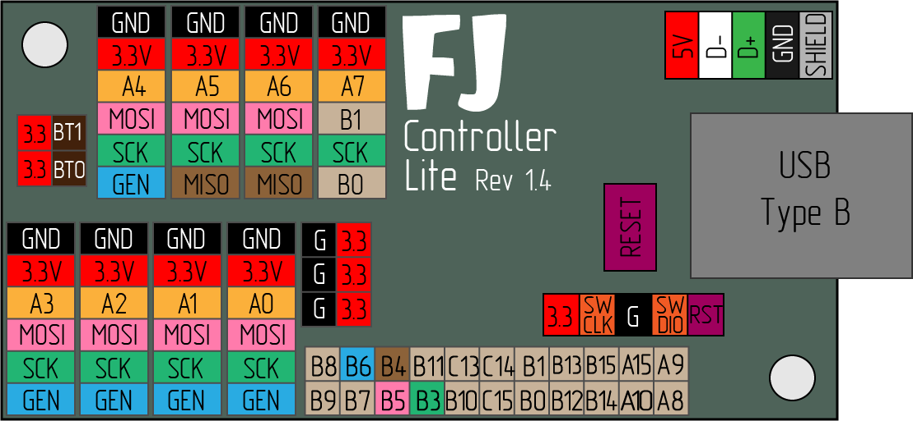

# Controller-Lite

FreeJoy Controller Lite is a replacement for BluePill board designed specially for joystick devices applications.

### Main features of the controller PCB:

* Reliable USB Type B connector
* Optional JST PH-2.0 connector for USB cable
* ESD protection
* Convenient JST PH-2.0 connectors for external periphery
* Analog supply filtering
* Embedded pull-up resistors for I2C data lines and TLE501x data line (pull-up can be disabled by cutting a bridge)
* 30 I/O pins
* Additional VCC (3.3V) and GND pins
* 2 LEDs (power indicator and user-defined)
* Reset button
* 2 mounting holes D=3mm
* PCB dimentions 30x60mm (excluding USB Type B connector)
